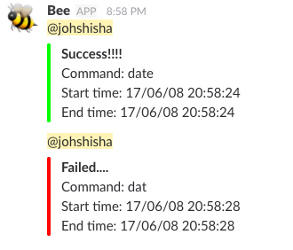

# Bee (+ Beetle)
## Bee
2017/06/08  
Slackに任意のコマンドの終了を通知する．



機械学習等の実行に時間のかかるプログラムを実行するときに利用する予定で作成した.

## Beetle
2019/04/11  
ログファイルのディレクトリを指定すると，最新のログファイルも送信してくれる.  
必要なければ，`bee.sh`内の`# ----- beetle -----`以下をコメントアウトor削除する．

### Setup
```
$ git clone https://github.com/PiroHiroPiro/bee.git
$ cd bee
$ chmod +x bee.sh
$ echo "alias bee=\"`pwd`/bee.sh\"" >> ~/.bashrc
$ source ~/.bashrc
```

もしbeetleを利用するのであれば，[Slack App Directory](https://beetle.slack.com/apps)よりbotを追加し，Tokenを取得する．  
また, 投稿先のSlack Channel IDを調べる(refs: [Slack — APIに使う「チャンネルID」を取得する方法](https://qiita.com/YumaInaura/items/0c4f4adb33eb21032c08)).

bee.sh内の以下の設定を自分の好きなように変える
```
...
# Webhook URL
WEBHOOKURL="YOUR_SLACK_WEBHOOK_URL"
# Slack Channel
CHANNEL=${CHANNEL:-"#general"}
...
# Mention User
MENTION_USER="@channel"
...
# Log directory
LOG_DIR=YOUR_LOG_DIR
# Slack BOT Token
BEETLE_TOKEN="YOUR_SLACK_BOT_TOKEN"
# Slack Channel ID
CHANNEL_ID=YOUR_SLACK_CHANNEL_ID
...
```

### How to use
```
$ bee $COMMAND
```
COMMANDは任意のコマンド

e.g.,
```
$ bee python train.py --epoch 50
```
